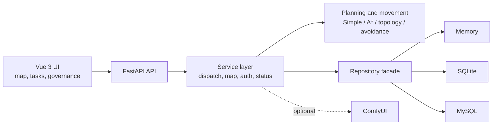

<div align="center">

# Smart Warehouse AGV Dispatch System

**A graduation project covering map modeling, task dispatch, path planning, multi-AGV avoidance, persistence, and enterprise governance.**

[中文](README.md) · [Quick start](#quick-start) · [Documentation](Repository/Package0.0/AGV_Graduation_Project/docs/README.md) · [Algorithms](Repository/Package0.0/AGV_Graduation_Project/docs/defense/DISPATCH_AND_ALGORITHMS.md)


[](LICENSE)

</div>

> This is my undergraduate graduation project. It implements an end-to-end software loop from warehouse map configuration and task creation to dispatch decisions, path planning, AGV state simulation, persistence, and Windows packaging.


## Highlights

| Area | Capabilities |
| --- | --- |
| Map modeling | Obstacles, irregular valid areas, reusable profiles, business points, and enterprise road topology |
| Dispatch | Automatic/manual assignment, priorities, multi-stage tasks, queues, blocking reasons, and recovery |
| Algorithms | Manhattan-style baseline, A* obstacle avoidance, topology routing, and side-by-side comparison |
| Multi-AGV runtime | Cell occupancy guards, dynamic yielding, conflict recovery, battery use, return, and charging |
| Governance | Personal, enterprise-admin, and platform-admin roles with applications, approvals, feedback, and audit |
| Persistence | One service layer with memory, SQLite, and MySQL repository implementations |
| Delivery | Vue/FastAPI app, demo assets, Windows launch/package scripts, acceptance notes, and regression checks |
| Optional AI | ComfyUI workflows for turning maps and experiment data into presentation assets |


## Architecture



The application source is under `Repository/Package0.0/AGV_Graduation_Project/` to preserve the original project history.

## Quick start

Requirements: Windows 10/11, Python 3.10+, and Node.js `^20.19.0` or `>=22.12.0`.

```powershell
git clone https://github.com/Novince404/AGV.git
cd AGV\Repository\Package0.0\AGV_Graduation_Project

python -m venv backend\venv
backend\venv\Scripts\python.exe -m pip install -r backend\requirements.txt

cd frontend\agv-frontend
npm install
cd ..\..
```

Start the backend and frontend in separate terminals:

```powershell
# Terminal 1, from the project root
cd backend
.\venv\Scripts\python.exe -m uvicorn main:app --reload
```

```powershell
# Terminal 2, from the project root
cd frontend\agv-frontend
npm run dev
```

Open `http://localhost:5173`. Memory mode is the default and needs no database service. See [Database Notes](Repository/Package0.0/AGV_Graduation_Project/backend/README_DATABASE.md) for SQLite and MySQL.

## Project status

- Latest stable tag: `v2.0.0`
- Current mainline: active post-`v2.0.0` development
- Validated primarily as a Windows-based graduation-project simulation and demo system

This repository intentionally excludes local environment files, databases, logs, dependencies, build artifacts, and personal thesis/defense materials. Seeded demo users and defaults are for local evaluation only. The project has not been certified for real industrial or safety-critical deployment.

## Documentation

- [Code structure](Repository/Package0.0/AGV_Graduation_Project/docs/defense/CODE_STRUCTURE.md)
- [Dispatch and algorithms](Repository/Package0.0/AGV_Graduation_Project/docs/defense/DISPATCH_AND_ALGORITHMS.md)
- [Database flow](Repository/Package0.0/AGV_Graduation_Project/docs/defense/DATABASE_FLOW.md)
- [Dynamic avoidance design](Repository/Package0.0/AGV_Graduation_Project/docs/plans/DYNAMIC_AVOIDANCE_DESIGN_NOTE.md)
- [Windows packaging](Repository/Package0.0/AGV_Graduation_Project/docs/release/PACKAGING_WINDOWS.md)
- [Changelog](Repository/Package0.0/AGV_Graduation_Project/CHANGELOG.md)

Feedback and contributions are welcome through [GitHub Issues](https://github.com/Novince404/AGV/issues). If the project helps your AGV studies or graduation work, a Star will help more people discover it.

## License

This project is licensed under the [PolyForm Noncommercial License 1.0.0](LICENSE):

- You may use it free of charge for noncommercial learning, research, experimentation, and testing, and may modify and share it under the license terms.
- Any commercial use requires the author's prior written permission.
- This repository is source-available and is not Open Source under the OSI definition.
- Third-party dependencies and components remain subject to their respective licenses.
