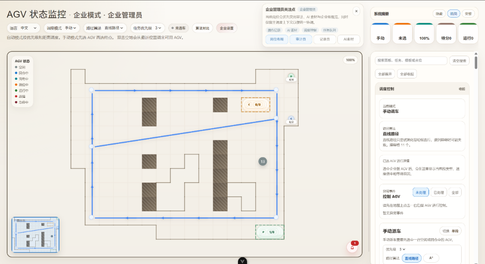
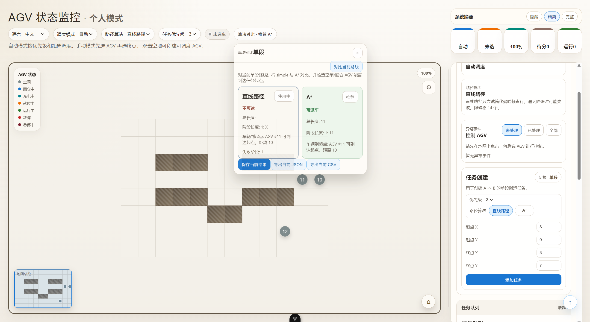
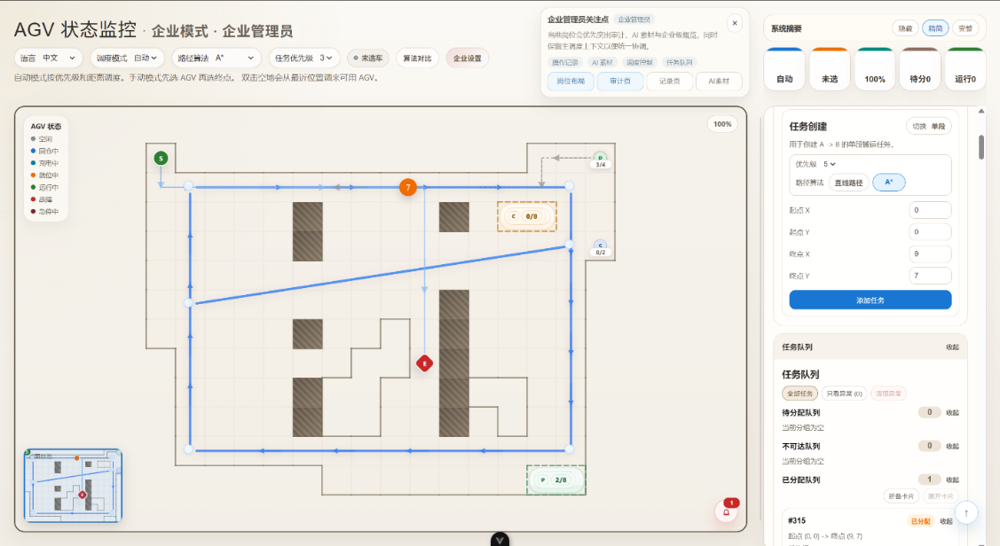
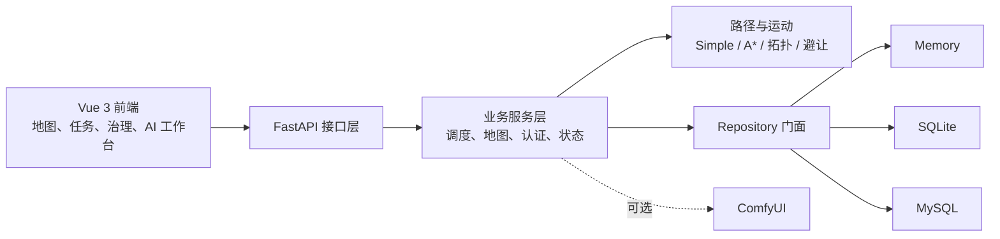

<div align="center">

# 智能仓储 AGV 调度系统

**一个覆盖地图建模、任务调度、路径规划、多车避让、数据持久化与企业治理的毕业设计项目。**

[English](README.en.md) · [快速开始](#快速开始) · [系统文档](Repository/Package0.0/AGV_Graduation_Project/docs/README.md) · [算法说明](Repository/Package0.0/AGV_Graduation_Project/docs/defense/DISPATCH_AND_ALGORITHMS.md)


[](LICENSE)

</div>

> 这是我的本科毕业设计。它不是一张静态的 AGV 地图，而是一条从地图与障碍物配置、任务创建、调度决策、路径规划、车辆状态推进，到数据库持久化和演示打包的完整软件闭环。



## 为什么做这个项目

仓储 AGV 系统同时涉及算法、业务规则、实时状态和工程交付。本项目希望用一个可运行、可解释、可演示的系统回答几个核心问题：任务如何分配给车辆，车辆如何绕开障碍与其他车辆，地图与任务如何长期保存，以及个人用户、企业用户和平台管理员如何在同一平台内协作。

项目已经通过毕业设计答辩，当前 `main` 分支是 `v2.0.0` 之后持续演进的产品化主线。

## 核心能力

| 方向 | 已实现能力 |
| --- | --- |
| 地图建模 | 障碍格、异形有效区、地图 Profile、常用点位、企业路网拓扑、导入与导出 |
| 任务调度 | 自动/手动派车、优先级、多阶段任务、任务队列、阻塞原因与恢复 |
| 路径算法 | 直线/曼哈顿基础路径、A* 绕障、企业拓扑路径、算法结果对比 |
| 多车运行 | 网格占用保护、动态避让、让行与冲突恢复、电量消耗、回仓与充电 |
| 多角色治理 | 个人用户、企业管理员、平台管理员、企业申请与审批、反馈和审计 |
| 数据持久化 | 统一 Repository 分层，可切换内存、SQLite、MySQL |
| 工程交付 | Vue/FastAPI 前后端、Windows 启动与打包脚本、演示数据、验收与回归脚本 |
| AI 扩展 | 可选 ComfyUI 工作流，用于把地图、任务和实验数据转为展示素材 |

## 路径规划效果

基础路径便于解释且计算快速；A* 会将障碍格和异形地图空洞视为不可通行区域，更适合复杂仓储场景。企业模式还可以在网格之上增加带方向、容量和占用约束的拓扑路网。





## 系统结构



核心源码位于：

```text
Repository/Package0.0/AGV_Graduation_Project/
├─ backend/                    # FastAPI、调度、算法、Repository、数据库
├─ frontend/agv-frontend/      # Vue 3 地图与操作界面
├─ enterprise_client/          # 企业独立客户端说明与验收资料
├─ demo/                       # 可导入的地图、障碍物和任务示例
├─ docs/                       # 设计、演示、验收、发布与答辩文档
└─ tools/windows/              # 开发、数据库检查和打包辅助脚本
```

## 快速开始

### 环境要求

- Windows 10/11（启动与打包脚本以 Windows 为主）
- Python 3.10+
- Node.js `^20.19.0` 或 `>=22.12.0`

### 1. 获取源码

```powershell
git clone https://github.com/Novince404/AGV.git
cd AGV\Repository\Package0.0\AGV_Graduation_Project
```

### 2. 安装后端

```powershell
python -m venv backend\venv
backend\venv\Scripts\python.exe -m pip install -r backend\requirements.txt
```

默认使用内存模式，无需安装数据库。需要持久化时，可复制 `backend/.env.example` 为 `backend/.env`，再选择 SQLite 或 MySQL；请勿提交本机 `.env`。

### 3. 安装前端

```powershell
cd frontend\agv-frontend
npm install
cd ..\..
```

### 4. 启动开发环境

在两个终端分别运行：

```powershell
# 终端 1：后端
cd backend
.\venv\Scripts\python.exe -m uvicorn main:app --reload
```

```powershell
# 终端 2：前端（从项目根目录开始）
cd frontend\agv-frontend
npm run dev
```

打开 `http://localhost:5173`。依赖安装完成后，也可以直接运行 `tools\windows\run_dev.bat`。

## 数据模式

| 模式 | 适用场景 | 额外依赖 |
| --- | --- | --- |
| `memory` | 快速体验、功能开发、临时演示 | 无 |
| `sqlite` | 单机持久化、打包演示、回归检查 | 无独立数据库服务 |
| `mysql` | 多会话与正式数据库联调 | MySQL 服务与本地凭据 |

详细配置见 [Database Notes](Repository/Package0.0/AGV_Graduation_Project/backend/README_DATABASE.md)。

## 文档导航

- [完整项目说明](Repository/Package0.0/AGV_Graduation_Project/README.md)
- [代码结构](Repository/Package0.0/AGV_Graduation_Project/docs/defense/CODE_STRUCTURE.md)
- [调度与算法](Repository/Package0.0/AGV_Graduation_Project/docs/defense/DISPATCH_AND_ALGORITHMS.md)
- [数据库链路](Repository/Package0.0/AGV_Graduation_Project/docs/defense/DATABASE_FLOW.md)
- [动态避让设计](Repository/Package0.0/AGV_Graduation_Project/docs/plans/DYNAMIC_AVOIDANCE_DESIGN_NOTE.md)
- [Windows 打包](Repository/Package0.0/AGV_Graduation_Project/docs/release/PACKAGING_WINDOWS.md)
- [Changelog](Repository/Package0.0/AGV_Graduation_Project/CHANGELOG.md)

## 版本状态

- 最新稳定标签：`v2.0.0`
- 当前主线：`post-v2.0.0` 持续开发版
- 前端包版本仍保留为 `2.0.0`，下一次正式 Release 再统一调整版本号与变更记录

## 安全与使用边界

- 仓库只公开源码、示例数据和通用技术文档；本机 `.env`、数据库、日志、依赖、构建产物、论文和个人答辩材料不会提交。
- 项目包含便于演示的种子账号与默认配置，它们不应直接用于生产环境。
- 本项目面向教学、研究与软件仿真，尚未经过真实工业设备和安全关键场景认证。
- ComfyUI 是可选的展示增强模块，不参与核心调度决策。

## 参与项目

欢迎通过 [Issues](https://github.com/Novince404/AGV/issues) 提交问题、改进建议或使用反馈，也欢迎围绕多车协同、动态避障、设备协议、调度指标与可视化继续扩展。

如果这个项目对你的课程设计、毕业设计或 AGV 调度学习有帮助，欢迎点一个 Star，让更多人看到它。

## 许可证

本项目采用 [PolyForm Noncommercial License 1.0.0](LICENSE)：

- 可免费用于非商业目的的学习、研究、实验和测试，并可按照许可证修改与分享。
- 任何商业使用均须事先获得作者的书面许可。
- 本仓库属于“源码公开（source-available）”，不属于 OSI 定义的开源软件。
- 第三方依赖与组件仍分别受其各自许可证约束。
