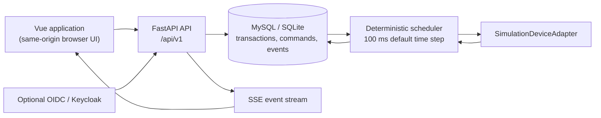

# v3 Enterprise Trial Architecture

> Release identity is the repository-root [`VERSION`](../../VERSION) file. The
> current branch is the `v3.0.0-beta.2` engineering baseline; it is an
> enterprise trial, not an industrial safety-certified controller.

## Runtime boundaries

The v3 trial runtime separates request handling from simulation scheduling.
The API can be scaled independently from the scheduler, while the scheduler
uses a database lease to ensure that only one worker advances the simulation.

| Boundary | Responsibility | v3 trial constraint |
| --- | --- | --- |
| Browser/UI | User interaction, role-aware navigation, event display | It talks to versioned APIs and uses secure cookies rather than local-storage session tokens. |
| API process | Authentication, authorization, input validation, transactional command creation, query APIs | It does not advance vehicles or take the scheduling lease. |
| Scheduler process | Fixed-step state machine, command consumption, lease renewal, event production | It is single-leader per deployment, not a multi-scheduler cluster. |
| Device adapter | Converts a scheduler command to telemetry/receipt events | `SimulationDeviceAdapter` only. No PLC, serial, MQTT, or physical AGV integration is provided. |
| Database | Business data, schema version, command queue, idempotency records, event history, scheduler lease | MySQL is the Docker trial default; SQLite is supported for single-machine use. |
| OIDC provider | External identity proofing | Local AGV roles and organizations remain locally approved and managed. |

## Command and event flow

1. A user submits a validated `/api/v1` command with an optional
   `Idempotency-Key`.
2. The API writes the command and its idempotency record in persistent storage.
3. The lease holder claims commands in a deterministic order, sends them to
   the simulation adapter, then records completion or rejection.
4. Telemetry changes become persisted runtime events and are delivered through
   Server-Sent Events. A reconnect can resume from `Last-Event-ID`.

This separation makes an API restart different from a simulation decision: a
fresh API process can continue to serve reads, and an eligible scheduler can
take over after the lease expires. It does **not** create high availability for
the database or replace operational backup procedures.

## Compatibility and security posture

- `/api/v1` is the stable v3 surface. Legacy unversioned paths remain
  available during the v3 compatibility window and return deprecation headers.
- The database evolves through Alembic migrations. Normal repositories must
  not perform schema-altering work.
- Trial and production profiles disable demo users by default, require a
  bootstrap recovery administrator to be explicitly configured, use Argon2id
  password hashes, hash stored session tokens, and can enforce CSRF checks.
- OIDC identities are bound by `(issuer, subject)` only after local approval;
  OIDC claims do not automatically grant an AGV role or tenant access.

For operational limits, deployment settings, and recovery instructions, see
[Docker trial deployment](../deployment/DOCKER_TRIAL.md),
[database migrations](../deployment/DATABASE_MIGRATIONS.md), and the root
[security policy](../../SECURITY.md).
